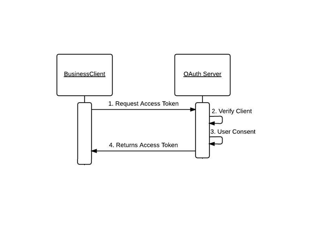

# LAB - Class 14

## Topic: Auth Server

### Author: Muhammed Tommalieh

### Links and Resources

- [Submission PR](https://github.com/401-advanced-javascript-tommalieh/auth-server/pull/5)

### Setup

#### How to initialize/run your application (where applicable)

- e.g.
- `nodemon`
- `get(http https://class12-oauth.herokuapp.com//users/).set({Authorization: username:password})`

#### Tests

- Visual tests were preformed
- Jest and lint tests were preformed for this class

#### UML

